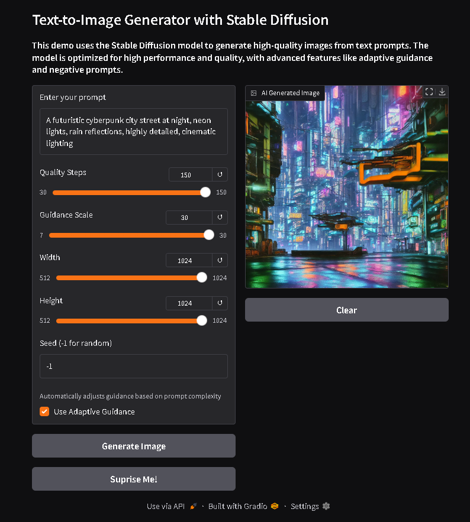

# Text to Image Generator
A Python-based text-to-image generation tool leveraging stable diffusion models. This application provides enhanced control over image generation through optimized parameters, improved prompting, and an efficient interface.

Features include weighted negative prompts, dynamic thresholding, optimized VAE processing, and memory-efficient operations. Available both as a local application and Google Colab notebook for flexible deployment options.



## Key Improvements

### Enhanced Negative Prompts
- Weighted emphasis (1.4x, 1.5x) on critical issues
- Comprehensive categories with better organization
- Stronger focus on preventing duplications and deformities

### Optimized Parameters
- Increased default steps to 50 for better quality
- Adjusted guidance range (7-30, default: 15)
- Added dynamic thresholding
- Enhanced scheduler configuration

### Improved Prompt Weighting
- Main subject emphasis: 1.4x
- Secondary elements: 1.2x
- Better distribution of emphasis

### Technical Optimizations
- Sequential CPU offload
- Automatic attention slicing
- Enhanced VAE optimization
- Improved memory management

### UI Enhancements
- Extended quality steps range (30-150)
- Better step increments
- Added information tooltips
- Improved layout and descriptions

## Expected Results
- Higher quality images with fewer artifacts
- No duplications or deformed bodies
- More accurate prompt following
- Better overall consistency

## Setup Guide

### Google Colab Setup
1. Open `Text-to-img.ipynb` in Google Colab
2. Select 'Runtime' > 'Change runtime type' > Choose 'T4 GPU'
3. Run all cells in sequence

### Local Installation

#### 1. Clone Repository
```bash
git clone https://github.com/SauRavRwT/text-to-img.git
cd text-to-img
```

#### 2. Create Virtual Environment
Windows:
```bash
python -m venv venv
venv\scripts\activate
```

Linux/Mac:
```bash
python -m venv venv
source venv/bin/activate
```

#### 3. Install Dependencies
```bash
pip install -r requirements.txt
```

#### 4. Launch Application
```bash
python app.py
```
